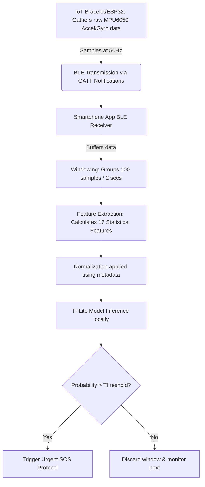

# Machine Learning Architecture & Implementation Guide
*Asfalis Frontend Application*

This document provides a detailed overview of the Machine Learning (ML) architecture implemented in the Asfalis mobile application. It covers how data is collected from an IoT device, transmitted, processed, and evaluated directly on the user's smartphone.

---

## 1. ML Model Implementation in the Frontend

The Asfalis application utilizes **TensorFlow Lite (TFLite)** to run the machine learning model directly within the Android client app. 

*   **TFLite Interpreter:** The core of the frontend ML is handled by the `SOSDetector` Kotlin class. It instantiates a TFLite `Interpreter` which loads the mapped model file (`auto_sos_mobile.tflite`) from the Android assets folder.
*   **Metadata Integration:** A generic `model_metadata.json` file is also bundled natively. It specifies the necessary normalization parameters (mean and scaling factors) and the required confidence threshold.
*   **Inference Process:** The frontend extracts 17 calculated features (derived from sensor data), normalizes them using the bundled metadata, and passes a `[1, 17]` shape array into the TFLite model. The model outputs a probability value (0.0 to 1.0) indicating the likelihood of a distress event.
*   **Trigger Mechanism:** If the predicted probability exceeds the recommended threshold (e.g., `> 0.8`), the frontend immediately triggers the SOS workflow.

---

## 2. Rationale for Moving ML from Backend to Frontend

Initially, sensor data was streamed to a cloud backend (using LightGBM/Random Forest) for inference. The model was converted to a TFLite-compatible Neural Network and shifted entirely to the mobile frontend for several critical reasons:

1.  **Zero Latency:** In emergency panic/SOS situations, every millisecond counts. Eliminating the network round-trip means the system reacts instantaneously.
2.  **Offline Capability:** The system continues to offer full protection even if the user drops into an area with no mobile data coverage or Wi-Fi.
3.  **Data Privacy:** Continuous highly-sensitive IMU (motion) data no longer needs to leave the user's device. Processing locally guarantees absolute privacy.
4.  **Reduced Server Costs:** Removing continuous stream processing from the cloud significantly lowers backend infrastructure and compute costs.

---

## 3. Advantages and Disadvantages of Frontend vs Backend ML

### **Frontend ML (Edge AI)**
| Advantages | Disadvantages |
| --- | --- |
| 🛡 **Privacy:** User data never leaves the device. | 📦 **App Size:** Bundling the `.tflite` model increases the APK size. |
| ⚡ **Speed:** Immediate inference, zero network latency. | 🔋 **Battery Drain:** Running intense continuous inference on-device can consume more power. |
| 📴 **Offline Support:** Requires no internet connection. | 🔄 **Updates:** Updating the model requires shipping an App update via the Play Store (or implementing OTA updates). |
| 💰 **Cost-Efficiency:** Zero cloud inference computing costs. | ⚙️ **Compute Limits:** Smartphones have less compute power than cloud GPUs, requiring lightweight models. |

### **Backend ML (Cloud AI)**
| Advantages | Disadvantages |
| --- | --- |
| 🔄 **Easy Updates:** Models can be swapped instantly without user action. | ⏳ **Latency:** Round-trip network times severely delay emergency triggers. |
| 🧠 **Intensive Compute:** Can run massive, complex models (e.g., Large LLMs). | 📡 **Internet Dependency:** Fails to protect users in dead zones. |
| 🔋 **Battery Efficient:** Phone only acts as a passive transmitter. | 💸 **High Costs:** Sustaining continuous websocket connections and inference is expensive. |

---

## 4. Data Collection

*   **Type of Data:** Primarily motion kinematics tracking via two key hardware sensors:
    *   **Accelerometer:** Measures linear acceleration (X, Y, Z axes).
    *   **Gyroscope:** Measures angular velocity / rotation (X, Y, Z axes).
*   **Data Source:** An external **IoT Smart Bracelet** equipped with an embedded IMU (Inertial Measurement Unit) sensor, such as the MPU6050, controlled by an ESP32 microcontroller. 

---

## 5. Data Format

Data is gathered continuously on the microcontroller and sent in structured packets to the smartphone. 

*   **Format:** Typically transmitted as lightweight **JSON** over Bluetooth strings or using pure byte/binary encodings to save bandwidth.
*   **Example JSON Structure:**
```json
{
  "timestamp": 1711961234567,
  "ax": -0.45,
  "ay": 9.81,
  "az": 1.22,
  "gx": 0.05,
  "gy": -0.11,
  "gz": 0.01
}
```

---

## 6. Data Transmission

*   **IoT to Frontend Communication:** The physical transmission mechanism is **Bluetooth Low Energy (BLE)**. The Android Native App acts as the BLE Central (Client), subscribing to Notifications from the ESP32 (BLE Peripheral/Server).
*   **Windowing Technique:** Instead of predicting on raw ticks, raw sensor events are grouped into "windows". For instance, taking a 2-second moving window.
*   **Samples Per Window:** If the ESP32 samples at **50Hz** (50 readings a second), a 2-second window contains exactly **100 samples**. 
    *   *Why this number?* Human motion like a fall, a struggle, or a sudden jerk takes ~1-3 seconds to fully articulate. A window of this size perfectly isolates a distinct physical maneuver for the model to classify, distinguishing between dropping a phone and a genuine physiological emergency.

---

## 7. Data Processing pipelines

1.  **Feature Extraction:** Once a window is recorded (e.g. 100 samples), the Android app extracts exactly **17 statistical features** from those arrays. These might include mean, variance, max, min, rolling averages, or signal magnitude area across the different axes.
2.  **Normalization (Data Cleaning):** These 17 features are raw unscaled numbers. Before hitting the neural network:
    *   The `SOSDetector` pulls the mean and scale values from `model_metadata.json`.
    *   Formula applied: `Normalized_Value = (Raw_Feature - Mean) / Scale`
3.  **Feeding the Model:** The resulting array (`FloatArray(17)`) is packaged as a multidimensional array input (`[1, 17]`) and fed directly into the TFLite execution thread via `Interpreter.run()`.

---

## 8. End-to-End Data Flow Overview



---

## 9. IoT Integration Guide (ESP32)

To successfully implement the hardware layer, the following steps must be managed on the ESP32 IoT Bracelet:

1.  **Hardware Hookup:** Connect an MPU6050 (or equivalent IMU) to the ESP32 using I2C communication (SDA & SCL pins).
2.  **Sampling Implementation:** 
    *   Initialize the IMU on boot.
    *   Set up a hardware timer or `millis()` loop to read the IMU purely at the intended sample frequency (e.g. exactly every 20ms for 50Hz).
3.  **BLE Server Setup:**
    *   Initialize the BLE server on the ESP32.
    *   Create a BLE Service (e.g., `0x181A` for Environmental Sensing, or a Custom UUID).
    *   Create a Characteristic with `NOTIFY` properties.
4.  **Continuous Push:**
    *   Map the raw X/Y/Z floats to a JSON string buffer or binary array.
    *   Continuously call `characteristic.setValue()` and `characteristic.notify()` to blast the realtime data to the connected Android smartphone.
5.  **Frontend Synchronisation:**
    *   The frontend discovers the ESP32, connects, and enables Notifications on that Characteristic.
    *   The app parses the incoming packets, feeding the internal sliding window until it possesses sufficient data limits to execute the ML model inference.
